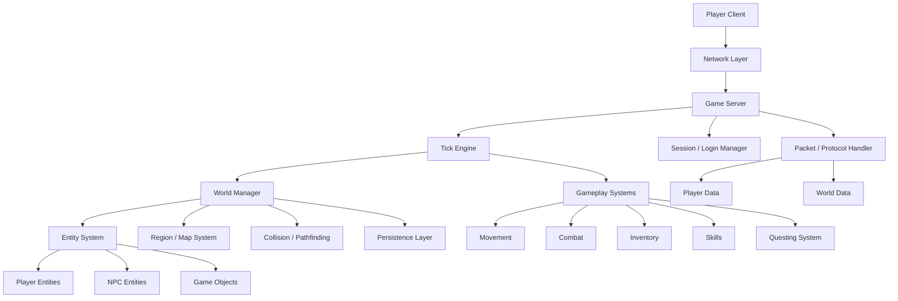

# Architecture Diagram

This diagram shows the current and planned high-level architecture of the projec.

## High-Level System Architecture


## Tick Update Flow

```mermaid
flowchart TD
  A[Server Starts] --> B[Tick Engine Begins Loop]
  B --> C{Next Tick Reached?}
  C -- No --> D[Sleep Briefly]
  D --> C
  C -- Yes --> E[Process Incoming Actions]
  E --> F[Update Players]
  F --> G[Update NPCs]
  G --> H[Update World Events]
  H --> I[Send State Updates to Clients]
  I --> J[Advance to Next Tick]
  J --> C